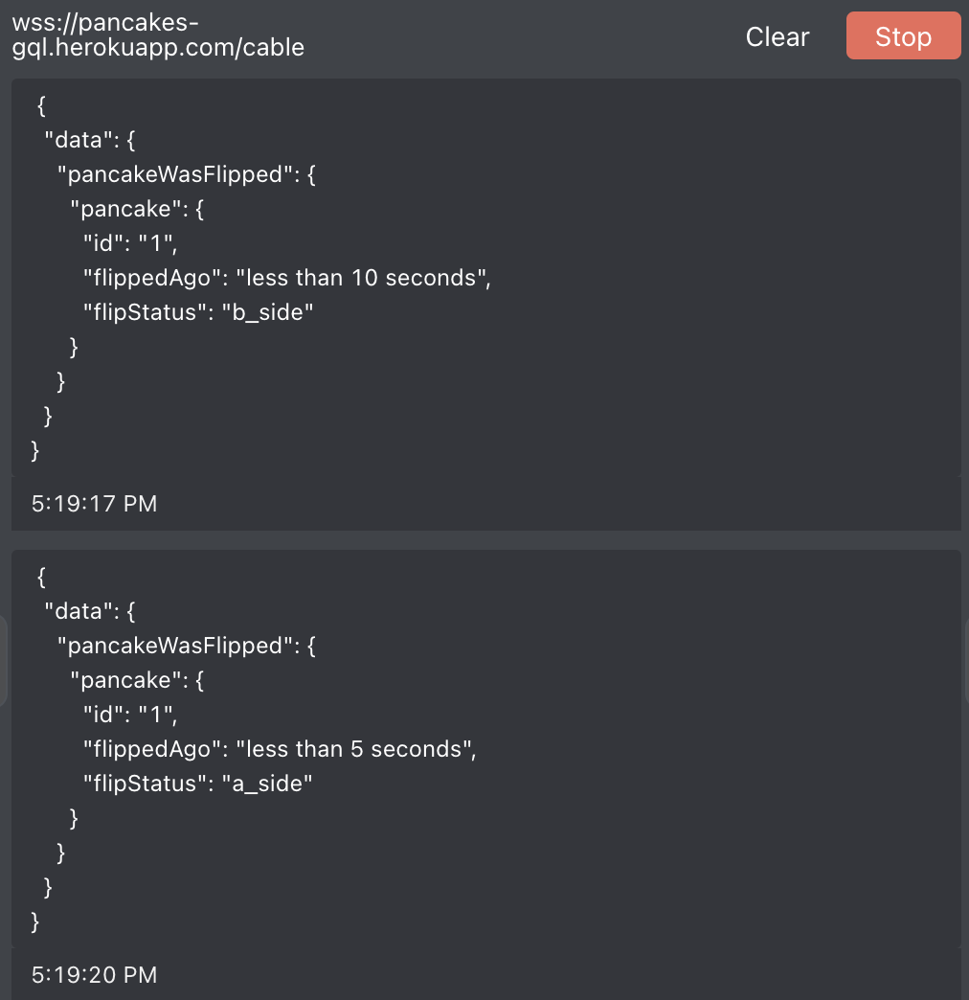

## Dummy Rails App (graphql-ruby, ActionCable subscriptions test)
Simple rails app to test adding actioncable subscription provider to Altair GraphQL client (see: https://github.com/imolorhe/altair/pull/1390)

- graphql API URL: https://pancakes-gql.herokuapp.com/graphql
- subscription endpoint: wss://pancakes-gql.herokuapp.com/cable

## Instructions to test the new altair subscription provider for ActionCable:
1. Have two tabs open
2. In one tab, subscribe to pancake flip event:
```gql
subscription {
  pancakeWasFlipped {
    pancake {
      id
      flippedAgo
      flipStatus
    }
  }
}
```
3. In the other tab, use this mutation to flip the pancake and trigger broadcast:
```gql
mutation {
  flipPancake {
    pancake {
      id
      flipStatus
      flippedAgo
    }
  }
}

```
4. You should see the following updates on each mutation post:

